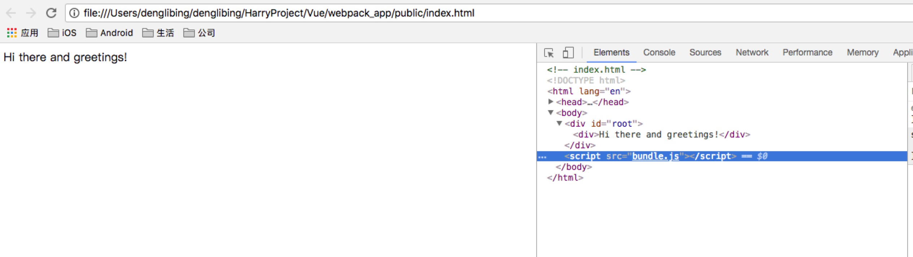

>webpack可以看做是**模块打包机**：它做的事情是，分析你的项目结构，找到JavaScript模块以及其它的一些浏览器不能直接运行的拓展语言（Scss，TypeScript等），并将其转换和打包为合适的格式供浏览器使用。


>webpack的工作方式是：把你的项目当做一个整体，通过一个给定的主文件（如：index.js），webpack将从这个文件开始找到你的项目的所有依赖文件，使用loaders处理它们，最后打包为一个（或多个）浏览器可识别的JavaScript文件。


### 一、安装

```shell
#全局安装webpack
$ npm install -g webpack

#成功之后看看版本号
$ webpack --version
4.4.1

#全局安装 webpack-cli （webpack的4版本之后，需要单独安装webpack-cli）
$ npm install -g webpack-cli

#成功之后看看版本号
$ webpack-cli --version
2.0.14
```


### 二、项目工程使用webpack

#### 1、自动创建package.json,包含项目名称、项目描述、作者等信息

```shell
# 先建立一些文件夹
$ mkdir webpack_app
$ cd webpack_app
$ mkdir app
$ mkdir public

$ npm init
```

```javascript
// package.json
{
  "name": "webpack_app",
  "version": "1.0.0",
  "description": "",
  "main": "index.js",
  "scripts": {
    "test": "echo \"Error: no test specified\" && exit 1"
  },
  "author": "",
  "license": "ISC",
}
```


#### 2、在本项目中安装webpack作为依赖包

```shell
// 安装Webpack
$ npm install --save-dev webpack
```

```javascript
// package.json
{
  "name": "webpack_app",
  "version": "1.0.0",
  "description": "",
  "main": "index.js",
  "scripts": {
    "test": "echo \"Error: no test specified\" && exit 1"
  },
  "author": "",
  "license": "ISC",
  "devDependencies": {
    "webpack": "^4.5.0",
	"webpack-cli": "^2.0.14"
  }
}
```


#### 3、在项目中添加 `html` 和 `js` 文件：

```html
<!-- index.html -->
<!DOCTYPE html>
<html lang="en">
  <head>
    <meta charset="utf-8">
    <title>Webpack Sample Project</title>
  </head>
  <body>
    <div id='root'>
    </div>
    <script src="bundle.js"></script>
  </body>
</html>
```

```js
//main.js 
const greeter = require('./Greeter.js');
document.querySelector("#root").appendChild(greeter());
```

```js
// Greeter.js
module.exports = function() {
  var greet = document.createElement('div');
  greet.textContent = "Hi there and greetings!";
  return greet;
};
```

app文件夹用户存放原始数据和 `js` 模块，public文件夹用来存放供浏览器读取的文件（包含 webpack 打包生成的js文件），目录布局如下

```shell
$ tree -L 2
├── app
│   ├── Greeter.js
│   └── main.js
├── node_modules
│   ├── acorn
│   ├── acorn-dynamic-import
│   ├── ...
│   ├── ...
│   ├── ...
│   ├── y18n
│   └── yallist
├── package-lock.json
├── package.json
└── public
    ├── bundle.js
    └── index.html
```


#### 4、使用webpack打包得到 bundle.js

```shell
$ webpack app/main.js --output-filename bundle.js --output-path public/ --mode development

$ webpack app/main.js --output-filename bundle.js --output-path public/ --mode development
Hash: 0e7bdca1d4ed7ff39786
Version: webpack 4.4.1
Time: 104ms
Built at: 2018-4-9 11:13:07
    Asset      Size  Chunks             Chunk Names
bundle.js  3.37 KiB    main  [emitted]  main
Entrypoint main = bundle.js
[./app/Greeter.js] 156 bytes {main} [built]
[./app/main.js] 107 bytes {main} [built]
```


#### 5、使用浏览器打开 `index.html` 看效果：




#### 6、通过配置文件来使用 webpack，在当前文件夹新建 `webpack.config.js` 文件

```js
// webpack.config.js
module.exports = {
	// __dirname: node.js中的一个全局变量，指向当前执行脚本所在的目录
	entry: __dirname + "/app/main.js", //已多次提及的唯一入口文件
	mode: "development",
	output: {
		path: __dirname + "/public", //打包之后的文件存放的地方
		filename: "bundle.js" //打包后输出文件的文件名
	}
}
```

然后执行 webpack 的时候，会自动引用  `webpack.config.js` 文件中的配置选项

```shell
$ webpack
Hash: 0e7bdca1d4ed7ff39786
Version: webpack 4.4.1
Time: 122ms
Built at: 2018-4-9 11:45:51
    Asset      Size  Chunks             Chunk Names
bundle.js  3.37 KiB    main  [emitted]  main
Entrypoint main = bundle.js
[./app/Greeter.js] 156 bytes {main} [built]
[./app/main.js] 107 bytes {main} [built]
```

在命令行中输入命令需要代码类似于 `webpack` 这样的路径其实是比较烦人的，不过值得庆幸的是 `npm` 可以引导任务执行，对 `npm` 进行配置后可以在命令行中使用简单的 `npm start` 命令来替代上面略微繁琐的命令。在`package.json`中对`scripts`对象进行相关设置即可，设置方法如下:

```js
{
  "name": "webpack_app",
  "version": "1.0.0",
  "description": "",
  "main": "index.js",
  "scripts": {
    "start": "webpack"
  },
  "author": "",
  "license": "ISC",
  "devDependencies": {
    "webpack": "^4.5.0",
    "webpack-cli": "^2.0.14"
  }
}
```

npm的 `start` 命令是一个特殊的脚本名称，其特殊性表现在，在命令行中使用 `npm start` 就可以执行其对于的命令，如果对应的此脚本名称不是 `start` ，想要在命令行中运行时，需要这样用 `npm run {script name}` 如`npm run build`，我们在命令行中输入`npm start`试试，输出结果如下：

```shell
$ npm start

> webpack_app@1.0.0 start /Users/denglibing/denglibing/HarryProject/Vue/webpack_app
> webpack

Hash: 634165e44db6bf85f5b9
Version: webpack 4.5.0
Time: 111ms
Built at: 2018-4-9 12:42:31
    Asset      Size  Chunks             Chunk Names
bundle.js  4.36 KiB    main  [emitted]  main
Entrypoint main = bundle.js
[./app/Greeter.js] 156 bytes {main} [built]
[./app/main.js] 107 bytes {main} [built]
```

也就是说，打包方式现在有三种方式，但是其实本质还是一样的。


#### 7、webpack 生成 `Source Maps` 是调试更容易

在`webpack`的配置文件中配置`source maps`，需要配置`devtool`，它有以下四种不同的配置选项，各具优缺点，描述如下：

| devtool选项                    | 配置结果                                                     |
| ------------------------------ | ------------------------------------------------------------ |
| `source-map`                   | 在一个单独的文件中产生一个完整且功能完全的文件。这个文件具有最好的`source map`，但是它会减慢打包速度； |
| `cheap-module-source-map`      | 在一个单独的文件中生成一个不带列映射的`map`，不带列映射提高了打包速度，但是也使得浏览器开发者工具只能对应到具体的行，不能对应到具体的列（符号），会对调试造成不便； |
| `eval-source-map`              | 使用`eval`打包源文件模块，在同一个文件中生成干净的完整的`source map`。这个选项可以在不影响构建速度的前提下生成完整的`sourcemap`，但是对打包后输出的JS文件的执行具有性能和安全的隐患。在开发阶段这是一个非常好的选项，在生产阶段则一定不要启用这个选项； |
| `cheap-module-eval-source-map` | 这是在打包文件时最快的生成`source map`的方法，生成的`Source Map` 会和打包后的`JavaScript`文件同行显示，没有列映射，和`eval-source-map`选项具有相似的缺点； `cheap-module-eval-source-map`方法构建速度更快，但是不利于调试，推荐在大型项目考虑时间成本时使用。 |

对小到中型的项目中，`eval-source-map` 是一个很好的选项，再次强调你只应该开发阶段使用它，我们继续对上文新建的`webpack.config.js`，进行如下配置:

```js
// webpack.config.js
module.exports = {
	// __dirname: node.js中的一个全局变量，指向当前执行脚本所在的目录
	entry: __dirname + "/app/main.js", //已多次提及的唯一入口文件
	mode: "development",
	devtool: "eval-source-map",
	output: {
		path: __dirname + "/public", //打包之后的文件存放的地方
		filename: "bundle.js" //打包后输出文件的文件名
	}
}
```


#### 8、使用 webpack 构建本地服务器

webpack 提供一个可选的本地开发服务器，这个本地服务器基于node.js构建，可以实现你想要的这些功能，不过它是一个单独的组件，在webpack中进行配置之前需要单独安装它作为项目依赖

```shell
$ npm install --save-dev webpack-dev-server
```

成功之后， `package.json` 会变成这样：

```js
{
  "name": "webpack_app",
  "version": "1.0.0",
  "description": "",
  "main": "index.js",
  "scripts": {
    "start": "webpack"
  },
  "author": "",
  "license": "ISC",
  "devDependencies": {
    "webpack": "^4.5.0",
	"webpack-cli": "^2.0.14",
    "webpack-dev-server": "^3.1.3"
  }
}
```

devserver作为webpack配置选项中的一项，以下是它的一些配置选项，更多配置可参考[这里](https://webpack.js.org/configuration/dev-server/)

| devserver的配置选项 | 功能描述                                                     |
| ------------------- | ------------------------------------------------------------ |
| contentBase         | 默认webpack-dev-server会为根文件夹提供本地服务器，如果想为另外一个目录下的文件提供本地服务器，应该在这里设置其所在目录（本例设置到“public"目录） |
| port                | 设置默认监听端口，如果省略，默认为”8080“                     |
| inline              | 设置为`true`，当源文件改变时会自动刷新页面                   |
| historyApiFallback  | 在开发单页应用时非常有用，它依赖于HTML5 history API，如果设置为`true`，所有的跳转将指向index.html |

把这些命令加到webpack的配置文件中，现在的配置文件`webpack.config.js`如下所示:

```js
// webpack.config.js
module.exports = {
	// __dirname: node.js中的一个全局变量，指向当前执行脚本所在的目录
	entry: __dirname + "/app/main.js", //已多次提及的唯一入口文件
	mode: "development",
	devtool: "eval-source-map",
	output: {
		path: __dirname + "/public", //打包之后的文件存放的地方
		filename: "bundle.js" //打包后输出文件的文件名
	},

	devServer: {
		contentBase: "./public", //本地服务器所加载的页面所在的目录
		historyApiFallback: true, //不跳转
		inline: true //实时刷新
	}
}
```

在`package.json`中的`scripts`对象中添加如下命令，用以开启本地服务器：

```js
{
  "name": "webpack_app",
  "version": "1.0.0",
  "description": "",
  "main": "index.js",
  "scripts": {
    "start": "webpack",
    "server": "webpack-dev-server --open"
  },
  "author": "",
  "license": "ISC",
  "devDependencies": {
    "webpack": "^4.5.0",
    "webpack-cli": "^2.0.14",
    "webpack-dev-server": "^3.1.3"
  }
}
```

正如上面所说的，想要使用 `npm`  去执行 `"server": "webpack-dev-server --open"`，只需要在终端执行 `npm run server` 即可在本地的 `8080` 端口查看结果:

```shell
npm run server

> webpack_app@1.0.0 server /Users/denglibing/denglibing/HarryProject/Vue/webpack_app
> webpack-dev-server --open

ℹ ｢wds｣: Project is running at http://localhost:8080/
ℹ ｢wds｣: webpack output is served from /
ℹ ｢wds｣: Content not from webpack is served from ./public
ℹ ｢wds｣: 404s will fallback to /index.html
ℹ ｢wdm｣: wait until bundle finished: /
ℹ ｢wdm｣: Hash: 9321f0b8a98cc7c03b80
Version: webpack 4.5.0
Time: 1014ms
Built at: 2018-4-9 12:50:35
    Asset     Size  Chunks             Chunk Names
bundle.js  838 KiB    main  [emitted]  main
Entrypoint main = bundle.js
[./app/Greeter.js] 156 bytes {main} [built]
[./app/main.js] 107 bytes {main} [built]
[./node_modules/html-entities/index.js] 231 bytes {main} [built]
[./node_modules/loglevel/lib/loglevel.js] 7.68 KiB {main} [built]
[./node_modules/node-libs-browser/node_modules/punycode/punycode.js] 14.3 KiB {main} [built]
[./node_modules/querystring-es3/index.js] 127 bytes {main} [built]
[./node_modules/sockjs-client/dist/sockjs.js] 176 KiB {main} [built]
[./node_modules/strip-ansi/index.js] 161 bytes {main} [built]
[./node_modules/url/url.js] 22.8 KiB {main} [built]
   [0] multi (webpack)-dev-server/client?http://localhost:8080 ./app/main.js 40 bytes {main} [built]
[./node_modules/webpack-dev-server/client/index.js?http://localhost:8080] (webpack)-dev-server/client?http://localhost:8080 7.75 KiB {main} [built]
[./node_modules/webpack-dev-server/client/overlay.js] (webpack)-dev-server/client/overlay.js 3.58 KiB {main} [built]
[./node_modules/webpack-dev-server/client/socket.js] (webpack)-dev-server/client/socket.js 1.05 KiB {main} [built]
[./node_modules/webpack/hot sync ^\.\/log$] (webpack)/hot sync nonrecursive ^\.\/log$ 170 bytes {main} [built]
[./node_modules/webpack/hot/emitter.js] (webpack)/hot/emitter.js 77 bytes {main} [built]
    + 12 hidden modules
ℹ ｢wdm｣: Compiled successfully.
```

同时浏览器上会自动打开 `index.html` ，现在修改 `Greeter.js` 浏览器页面便会实时刷新最新的数据了。


