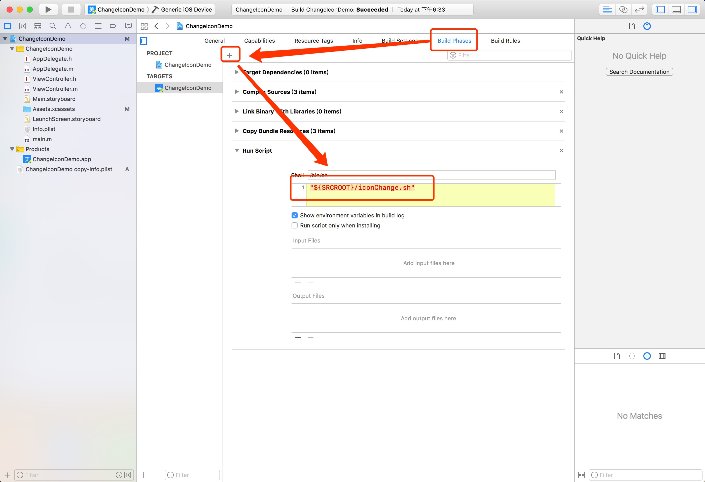
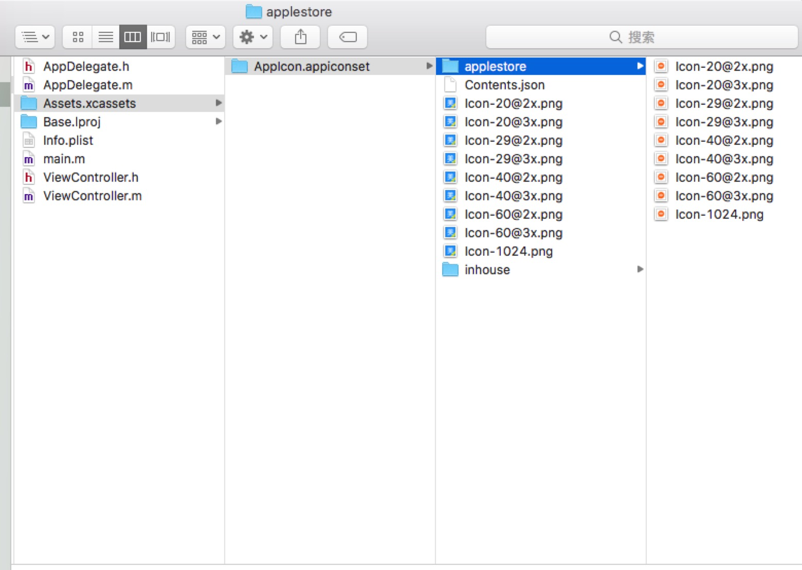

### 编译时动态改变App的Icon

> 在大型项目中，存在对同一份代码打包多份App的可能性（多个bundleIdentifier），这个时候就需要有一个醒目的标志来区分多个App，最有效的方式就是用Icon来区分。但是也不能对每个App在打包的时候，手动的替换Icon吧，想想都觉得要命。网上提供了很多关于在编译时修改App的Icon的博客，大概是在编译时通过各种方式来替换图片。得益于这些优秀的博客，下面将实现不同的bundleIdentifier打包时使用对应的Icon


#### 一、使用shell脚本来替换App的Icon源码如下：

```shell
#!/bin/sh

echo "============================================================"
currentBundleIdentifier="$PRODUCT_BUNDLE_IDENTIFIER"
echo "currentBundleIdentifier:" "$currentBundleIdentifier"

PATH_TO_APPICON="$(find . -name AppIcon.appiconset)"
echo  "$PATH_TO_APPICON"

meijuInHouseBundleIdentifier="com.msmart.meiju.inhouse"
meijuAppleStoreBundleIdentifier="com.msmart.meiju.appstore"

if [[ "$currentBundleIdentifier" == "$meijuInHouseBundleIdentifier" ]]; then
	cp  $SRCROOT/${PATH_TO_APPICON}/inhouse/*.png "${SRCROOT}/${PATH_TO_APPICON}/"
	echo "正在Build企业版本"
elif [[ "$currentBundleIdentifier" == "$meijuAppleStoreBundleIdentifier" ]]; then
	cp  $SRCROOT/${PATH_TO_APPICON}/applestore/*.png "${SRCROOT}/${PATH_TO_APPICON}/"
	echo "正在Build企业版本"
else 
	echo "正在Build" "$currentBundleIdentifier" "版本"
fi
echo "============================================================"
```


#### 二、使用流程：

1、将上面的源码修改成符合自己项目的源码，保存并命名为 `iconChange.sh` , 并和项目的 `.xcodeproj` 放在本一个路径下面；

2、打开项目工程，在 `Build Phases` 添加 `Run Script` ，并输入 `"${SRCROOT}/iconChange.sh"` ：

 

3、App需要的全套尺寸的Icon图片处理，这个脚本时针对的项目是使用 `Assets.xcassets` 中的 `AppIcon.appiconset` 有效。不同 bundleIdentifier 对应的全套尺寸的Icon图片，需要放在 `AppIcon.appiconset` 中，当然也可以修改脚本自定义路径。图片解释最清晰:

 

4、测试：修改项目的 bundleIdentifier 为 `com.msmart.meiju.inhouse` ，编译，App的Icon使用的是上图的 `inhouse` 文件夹中的图片集合；

修改项目的 bundleIdentifier 为 `com.msmart.meiju.appstore` ，编译，App的Icon使用的是上图的 `applestore` 文件夹中的图片集合；

5、同理，修改项目的 `LaunchImage` 也是可行。


#### 三、相关连接：

[How To Change Your App Icon at Build Time](https://www.raywenderlich.com/105641/change-app-icon-build-time)

[Change AppIcon at build time in xCode 9](https://stackoverflow.com/questions/45731001/change-appicon-at-build-time-in-xcode-9)

[如何在运行时改变App的图标](https://www.jianshu.com/p/ed29cd01acf6)

[测试代码地址](https://github.com/erduoniba/ChangeIconDemo)