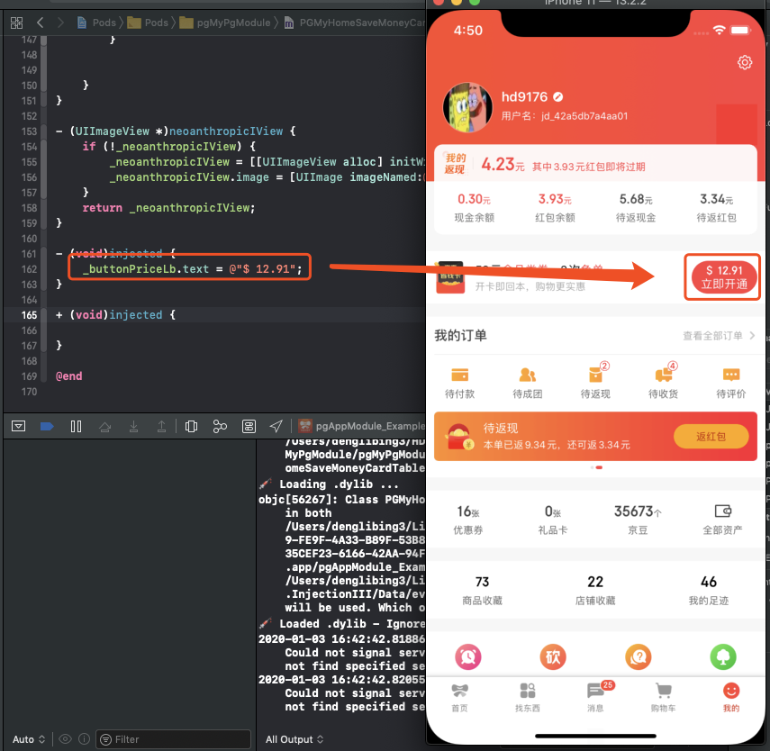

# iOS-注入动态库实现极速编译调试


### 问题篇


> iOS原生代码的编译调试，都是通过一遍又一遍的编译重启App来进行，所以，项目代码量越大，编译时间就越长。虽然我们 **京喜App** 是通过将部分代码先编译成二进制集成到工程里，来避免每次都全量编译来加快编译速度，但即使这样，每次编译都还是需要重启 App，需要再走一遍调试流程。


### 业界篇

`Swift Playground` : 是 Xcode 里集成的一个能够快速、实时调试程序的工具，可以实现所见即所得的效果

 


`Flutter Hot Reload`: Google 开发的一个跨平台开发框架，调试也是快速实时的

 


`Injection for Xcode` : 一个叫作 Injection 的工具可以动态地将 Swift 或 Objective-C 的代码在已运行的程序中执行，以加快调试速度，同时保证程序不用重启。

 


### 安装篇

**1、AppStore搜索 `InjectionIII` 安装下载 （作者还在维护）**

**2、下载源码进行编译安装（推荐），需要注意下载代码之后，同时需要拉去子模块代码**

[InjectionIII源码](https://github.com/johnno1962/InjectionIII)

 

编译运行后，会生成 `InjectionIII.app ` 将它拷贝到 `/Applicaions` 即可，然后打开


### 使用篇

**1、在项目中添加如下代码：**

```objective-c
- (BOOL)application:(UIApplication *)application didFinishLaunchingWithOptions:(NSDictionary *)launchOptions {
#if DEBUG
    [[NSBundle bundleWithPath:@"/Applications/InjectionIII.app/Contents/Resources/iOSInjection.bundle"] load];
#endif
}
```


**2、运行  `InjectionIII.app `**  

 

InjectionIII有多个颜色icon标示：

**蓝色**：已经启动 InjectionIII App

**黄色**：InjectionIII App 出错

**绿色**：InjectionIII App 繁忙

**橙色**：目前项目已经对Injection初始化成功，同时会在项目中的Xcode控制台打印


**💉 Injection connected 👍**

**💉 Watching /Users/denglibing3/HDProject/JDProject/pgAppModule/\****


启动后，点击选择需要监听的项目路径即可


**3、编译运行项目，然后在需要修改的文件中添加新的方法**

```objective-c
// 监听实例方法，需要当前类已经初始化，不然无效
- (void)injected
{
    NSLog(@"I've been injected: %@", self);
}

// 监听类方法
+ (void)injected
{
    NSLog(@"I've been injected: %@", self);
}
```

然后执行 `command+s` 保存当前类的代码即可 


**4、问题：**

- [x]  没有使用 `Cocoapods`  、`iBiu` 的项目注入 InjectionIII

- [x] 基于 `Cocoapods` 进行组件化开发，需要修改 `Cocoapods` 默认文件结构，具体解决方案见 [Changes made in development pod not recognized by file watcher and not injected](https://github.com/johnno1962/InjectionIII/issues/34)

- [ ] 基于 `iBiu` 进行组件化开发，如果需要在组件化工程中使用，目前不支持，因为 `iBiu` 固化了项目结构，导致 `xxx.xcworkspace` 文件和我们开发的文件不在同一路径下，如果 InjectionIII 比较收到我们的认可，可以联系 `iBiu` 支持我们自定义组件项目结构。报错信息：

  ```sh
  💉 *** Could not locate containing project or it's logs.
  For a macOS app you need to turn off the App Sandbox.
  Have you customised the DerivedData path? ***
  ```

  这个是因为 `InjectionIII` 会找寻 `.xcodeproj` 、`xcworkspace` 项目下的文件，但是基于 `Cocoapods` 、`iBiu` 的组件项目结构如下

  ```shell
  ECCMAC-C02VQ1V2:pgMyPgModule denglibing3$ tree -L 2
  .
  ├── Example
  │   ├── JDPushContentExtension
  │   ├── JDPushServiceExtension
  │   ├── JDTodayExtension
  │   ├── JDWatch
  │   ├── JDWatchExtension
  │   ├── Podfile
  │   ├── Podfile.lock
  │   ├── Pods
  │   ├── StickerPackExtension
  │   ├── Tests
  │   ├── pgMyPgModule
  │   ├── pgMyPgModule.xcodeproj
  │   ├── pgMyPgModule.xcworkspace
  │   └── pod_setup
  ├── LICENSE
  ├── README.md
  ├── _Pods.xcodeproj -> Example/Pods/Pods.xcodeproj
  ├── pgMyPgModule
  │   ├── Assets
  │   ├── Classes
  │   └── pgMyPgModule-umbrella.h
  └── pgMyPgModule.podspec
  ```

  我们组件代码在 `pgMyPgModule` 下面，而  `.xcodeproj` 、`xcworkspace`  同级下并没有该代码，所以无法定位 组件代码 在那个工程中。

- [x] 于 `iBiu` 进行组件化开发，在主工程，使用各个业务模块的源码集成，这个和上面的区别在于 `pgMyPgModule` 代码已经在 `Pods` 目录下，和 `pgAppModule.xcworkspace` 在同一级目录下。

  ```objective-c
  CCMAC-C02VQ1V2:pgAppModule denglibing3$ tree -L 3
  .
  ├── Example
  │   ├── JDPushServiceExtension
  │   ├── JDTodayExtension
  │   ├── JDWatch
  │   ├── JDWatchExtension
  │   ├── Podfile
  │   ├── Podfile.lock
  │   ├── Pods
  │   │   ├── Headers
  │   │   ├── JDBAPISignModule
  │   │   ├── JDBAPMModule
  │   │   ├── ......
  │   │   ├── pgMyPgModule
  │   │   ├── ......
  │   │   ├── pgUserManagerModule
  │   │   └── pgWebViewModule
  │   ├── pgAppModule.xcodeproj
  │   ├── pgAppModule.xcworkspace
  │   ├── pgAppModule_Example.entitlements
  │   └── 京?\234?\213?购UITests-Swift
  ├── LICENSE
  ├── README.md
  ├── _Pods.xcodeproj -> Example/Pods/Pods.xcodeproj
  ├── pgAppModule
  │   ├── Assets
  │   │   └── react.bundle
  │   ├── Classes
  │   │   ├── pgAppModule.h
  │   │   └── pgAppModule.m
  │   ├── Resource
  │   │   └── react.bundle
  │   └── pgAppModule-umbrella.h
  ├── pgAppModule.podspec
  └── post_build.sh
  ```


   


### 原理篇

 


 


参考链接

[InjectionIII源码](https://github.com/johnno1962/InjectionIII)

[Injection：iOS热重载背后的黑魔法](https://juejin.im/entry/5b1f4c5f5188257d7c35e9d9)

[iOS InjectionIII工具的使用及重载原理](https://www.jianshu.com/p/0489c654657d)

[Changes made in development pod not recognized by file watcher and not injected](https://github.com/johnno1962/InjectionIII/issues/34)

[iOS -> Socket自搭服务器通信](https://www.jianshu.com/p/d34d5c38f183)

